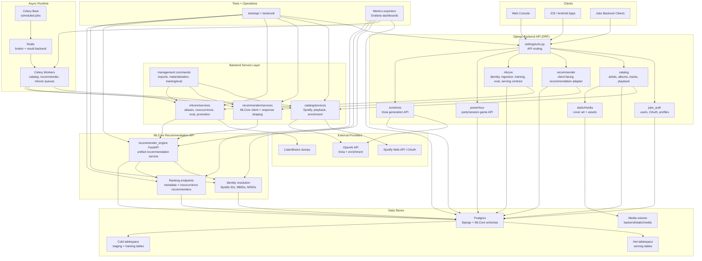

# Backend Architecture

This backend is a Django/DRF service with Celery workers, a Postgres data layer, and a unified MLCore recommendation API. The diagram below shows the major components and how data moves between them.

## Component Diagram



## Reading The Diagram

- Django owns the public API surface, authentication, catalog workflows, app-specific game APIs, and client-facing recommendation adapters.
- The service layer keeps domain logic and third-party integrations out of views and serializers.
- Celery Beat and Celery Workers handle scheduled and long-running ingestion, enrichment, training, and evaluation work through Redis.
- MLCore owns the recommendation contract: identity resolution, training/evaluation workflows, and ranking endpoints are consolidated behind the FastAPI recommendation API.
- MLCore separates hot serving data from colder staging and training data through Postgres tablespaces.
- External providers feed catalog metadata, source training data, and generated trivia/enrichment features.

## MLCore Isolation Contract

Model-local Django backends call the shared MLCore service with stable external identities. They must not send local Juke catalog UUIDs across the service boundary.

Supported identity pairs:

- `spotify:track`
- `musicbrainz:recording`
- `listenbrainz:recording`

Identity-aware recommendation requests accept at most 100 seeds and 100 exclusions. Spotify bare IDs, track URIs, and `open.spotify.com/track/...` URLs normalize to a bare Spotify track ID; MBIDs and MSIDs normalize to canonical UUID strings.

MLCore currently returns canonical recommendation IDs. Backend clients remain responsible for vendor-specific output resolution until the shared identity graph has enough provider aliases to perform that resolution locally on Neptune.

Responses include a correlation `request_id` and version provenance for the API contract, recommender model, latest cooccurrence training run, identity source snapshot, and identity materialization algorithm.

## Alias Materialization

Canonical alias materialization stores durable run state in `mlcore_canonical_alias_materialization_run`. Each batch commits its aliases and checkpoint together, allowing an interrupted run to continue with:

```bash
python manage.py materialize_canonical_aliases --resume-run-id <run-uuid>
```

Prometheus textfile metrics remain the live observability surface, while PostgreSQL is the source of truth for run status, counters, checkpoints, and source/algorithm versions.

## MusicBrainz Dump Staging

MLCore stages the official MusicBrainz core database dump on cold storage before
the MBID-to-ISRC bridge importer reads it. The core `mbdump.tar.bz2` archive is
the only required artifact: it contains `recording`, `isrc`, `url`,
`l_recording_url`, `link`, and `link_type`. The derived and edit-history dumps
are not needed for this bridge.

Preview the current official release and capacity requirement without
downloading it:

```bash
docker compose run --rm backend \
  python manage.py stage_musicbrainz_dump --plan --json
```

Stage and verify the release:

```bash
docker compose run --rm backend \
  python manage.py stage_musicbrainz_dump
```

The default cold path is
`/srv/data/backups/juke/musicbrainz/releases/<source-version>/`:

```text
manifest.json
raw/mbdump.tar.bz2
staging/
```

The command discovers `LATEST`, reads `SHA256SUMS` from the same official
release directory, checks free space, downloads through an atomic `.part`
file, verifies SHA-256 and required archive members, then records the release
in `mlcore_source_ingestion_run`. Reruns reuse a verified archive. A corrupt or
incomplete download never replaces the previous artifact.

The default pre-download requirement is **100 GiB free**. As of the
`20260613-002047` export, the core archive is 7,260,740,543 bytes (about
6.76 GiB). Budget **80 GiB expanded** until the first selective extraction
records exact table sizes; the command requires the larger of compressed plus
estimated-expanded bytes or the configured 100 GiB floor. Override the reserve
with `MLCORE_MUSICBRAINZ_MINIMUM_FREE_BYTES` only after accounting for
downstream staging needs.
