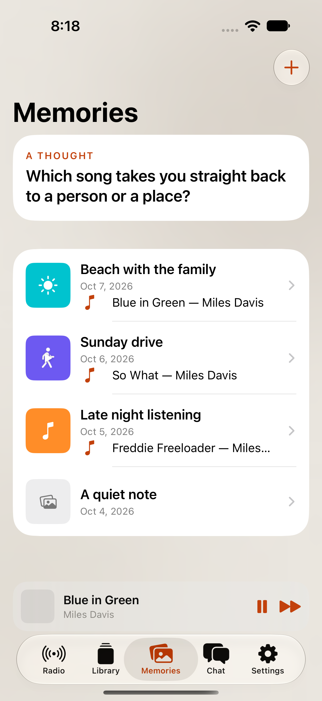
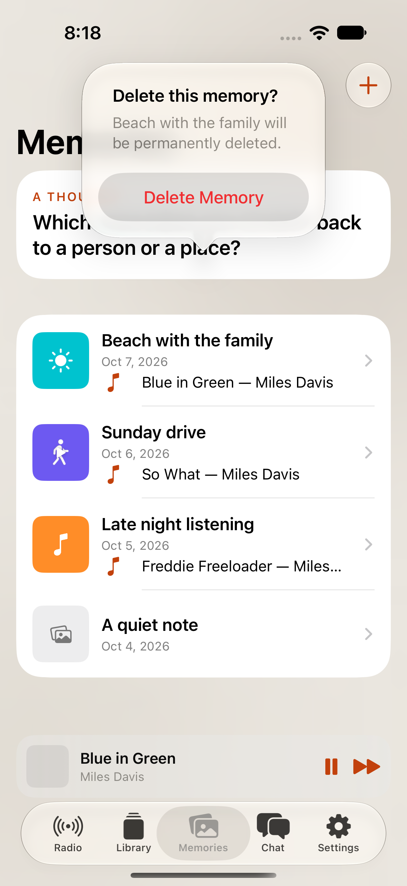

# H — Delete memories

Not verified on device. The UI test used fixture data in the iPhone 18 Pro simulator running iOS 27.0; it did not contact a live backend.

| Round3 reference | Memories before delete | Confirmation dialog |
| --- | --- | --- |
|  |  |  |

The Round3 reference image is the repository's static rendering of `Round3.reference.html` in its Radio state, used here as the shared style reference. The simulator screenshots show the Memories page and destructive confirmation.

Validation:

- `scripts/build_and_run_ios.sh -p jukeapp -s 170CE1B6-BA40-44C8-98CC-B6289854DA07` — build, install, and launch succeeded.
- `scripts/test_mobile.sh -p jukeapp --ios-only -s 170CE1B6-BA40-44C8-98CC-B6289854DA07 -o 27.0` — 67 unit tests passed.
- Focused `MemoryDeleteUITests` — 1 UI test passed; the flow confirms before deleting and removes the row after success.
- The H simulator was shut down after capture.
