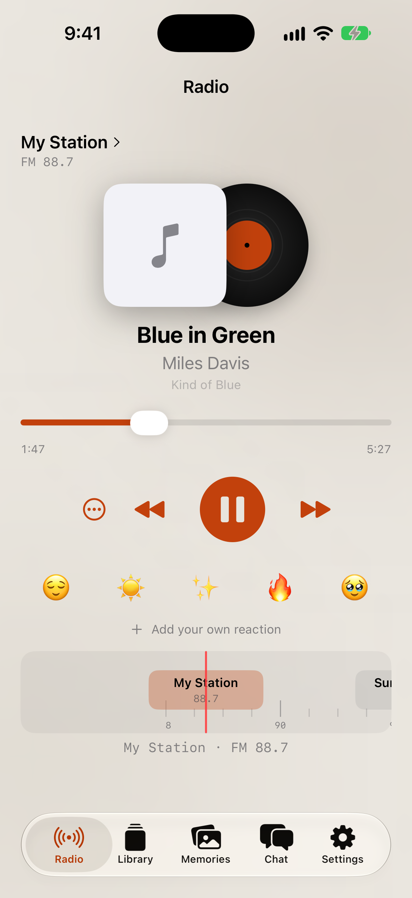

# PR K: Emoji slider

The iOS Radio reaction strip now supports hold, scrub, preview, and release to choose. Tap and VoiceOver controls remain available.

| Round 3 reference | iPhone 18 Pro, iOS 27.0 |
| --- | --- |
|  |  |

- Unit tests cover leftmost recency ordering, drag slot selection, VoiceOver adjustment, and account-scoped persistence.
- **Not verified on device.** The capture is from the required iOS simulator.
