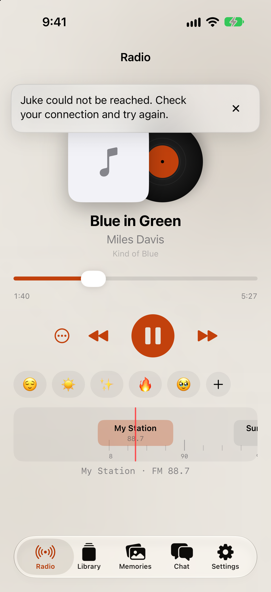

# PR L: Dismissible connection issue overlay

The Round 3 reference uses a floating card treatment for Radio content. The simulator capture applies that visual language to a connection issue while keeping it outside the page layout.

| Round 3 reference | iPhone 18 Pro, iOS 27.0 |
| --- | --- |
|  |  |

- `RadioIssuePresentationTests` covers dismissal across repeated identical polls, replacement by a changed issue, and re-presentation after the issue clears.
- **Not verified on device.** The capture is from the required iOS simulator.
