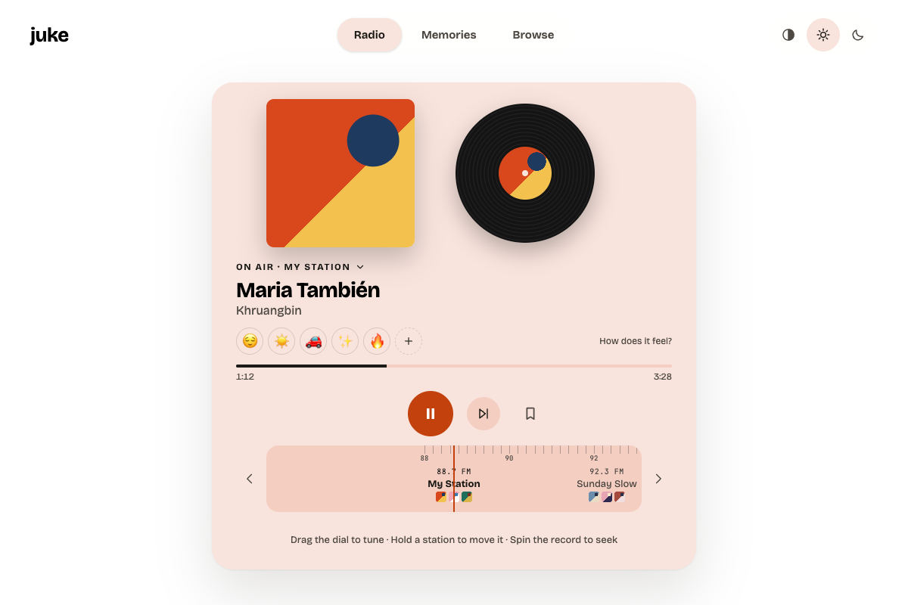
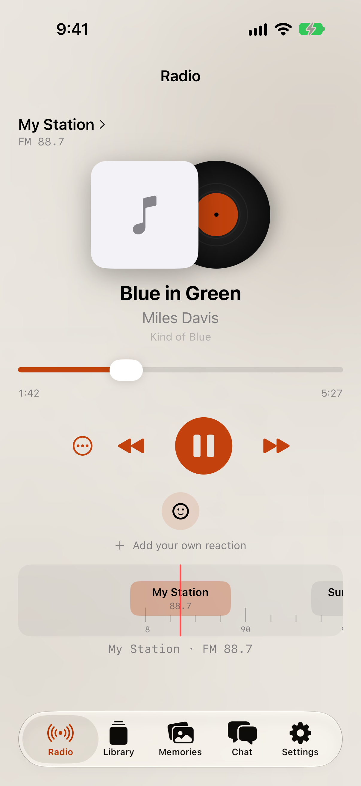
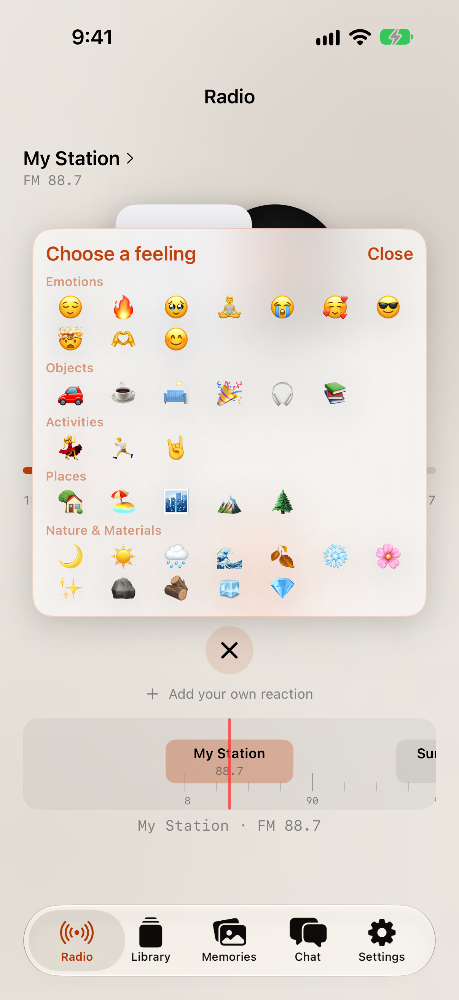
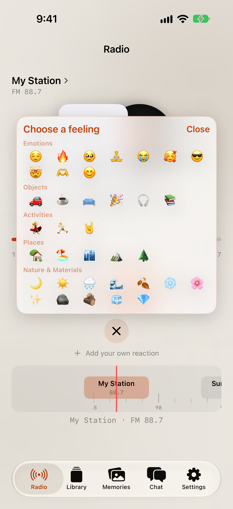
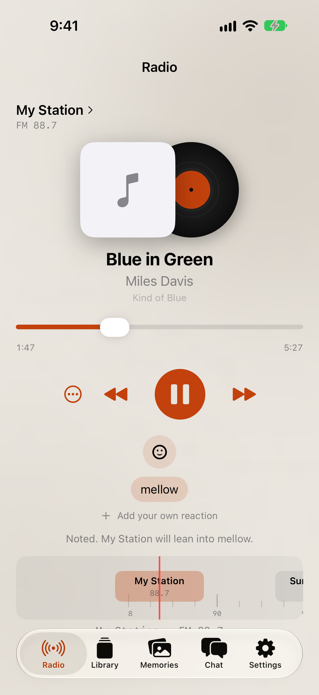

# PR T: Compact emoji chooser

At rest, the iOS reaction row shows up to four recently chosen or currently selected emojis and one chooser button. Tapping the button opens the catalogue; holding it opens the same catalogue for sliding preview and release to choose. The compact grid shows every catalogue group at once so a hold-slide reaches the final emoji without scrolling. Recent emoji buttons and palette buttons remain accessible to VoiceOver, and word reactions stay visible as removable chips.

Catalogue decision: retain the existing core reactions and group the iOS catalogue in this order: **Emotions → Objects → Activities → Places → Nature & Materials**. User-created emoji are appended under **Your emojis**. The existing flat Mac picker and reaction strip are unchanged.

| Round 3 reference | iPhone 18 Pro, iOS 27.0 simulator |
| --- | --- |
|  |  |
|  |  |
|  |  |

Word-reaction visibility capture: 

## Verification

- `PATH=/usr/sbin:$PATH scripts/build_and_run_ios.sh -p jukeapp -s 6A9957BE-0ED2-41D6-A5B5-FEC3022A7BF7` succeeded.
- iPhone 18 Pro / iOS 27.0 simulator UI tests passed: 4 tests, 0 failures. In addition to the existing chooser and word-reaction coverage, `testHoldAndSlideCanSelectEmojiFromLastCatalogueGroup` verifies that 💎 in Nature & Materials is hittable without scrolling and that a hold-slide selects it and promotes it to the leftmost recent slot.
- Reaction chooser unit tests passed: 5 tests, including catalogue grouping, recent row ordering, custom emoji placement, and leftmost recency.
- **Not verified on device:** no physical iPhone or live Spotify session was used. Verified in the iPhone 18 Pro iOS 27.0 simulator: app build/launch, chooser tap and hold/drag selection through the final catalogue group, recent emoji removal, and word reaction presentation/removal.
