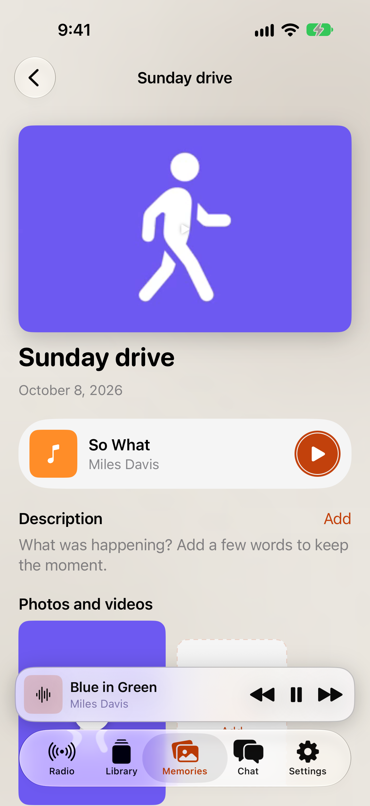

# PR W: Memory photos and videos

Decision: the main card image uses the first attached photo (`photo` media kind; the older `image` kind remains supported); if there is no photo, it uses the first attached video frame. Song artwork remains in the song row and serves as the card image only when the memory has no photo or video. Tapping a card image, detail cover, attachment tile, or song artwork opens a full-screen viewer. Photos fit the screen; videos play in that viewer; Done returns to the deck or detail page.

The Round 3 HTML reference is used as the shared visual-language comparison; its committed screenshot is the Radio state and does not depict the Memories page. The simulator captures show the actual memory card/detail and the full-screen photo/video viewer.

| Round 3 reference | iPhone 18 Pro / iOS 27.0 simulator |
| --- | --- |
|  |  |
|  |  |
|  |  |
|  |  |

## Verification

- `PATH=/usr/sbin:$PATH scripts/build_and_run_ios.sh -p jukeapp -s 6A9957BE-0ED2-41D6-A5B5-FEC3022A7BF7` succeeded.
- iPhone 18 Pro / iOS 27.0 simulator suite passed: 10 tests total, 0 failures (6 `MemoryThumbnailTests` and 4 focused UI tests). UI coverage includes card photo viewer, card video viewer, detail photo and song-artwork viewers, dismissal, and return to detail/deck.
- Media choice unit tests cover photo-before-video-before-artwork and artwork fallback when no memory media exists.

**Not verified on device:** no physical iPhone, live signed-in memory account, or live memory-media backend was used. Verified using canned UI fixtures in the iPhone 18 Pro iOS 27.0 simulator: card photo and video viewer presentation, detail photo and song-artwork viewer presentation, viewer dismissal, and the card-to-detail path. VoiceOver was not exercised on a physical device.
